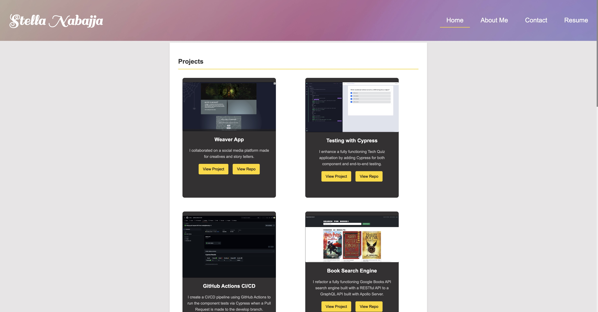

# React Portfolio

[](https://reactjs.org/) [](https://vitejs.dev/) [](https://www.npmjs.com/)

A single-page application portfolio built with **React** and **Vite** that showcases my experience, projects, proficiencies, and contact information in a sleek and responsive design.

## Table of Contents

- [React Portfolio](#react-portfolio)
  - [Table of Contents](#table-of-contents)
  - [📖Description](#description)
  - [✨Features](#features)
  - [⚙️Installation](#️installation)
    - [Prerequisites](#prerequisites)
    - [Steps](#steps)
  - [Usage](#usage)
    - [Screenshot of the deployed application.](#screenshot-of-the-deployed-application)
    - [🚀 **Checkout the live Portfolio App on Netlify**](#-checkout-the-live-portfolio-app-on-netlify)
  - [💻Technologies Used](#technologies-used)
  - [📄License](#license)
  - [Contributing](#contributing)
  - [Tests](#tests)
  - [Questions](#questions)

## 📖Description

This project is a modern React Portfolio that displays multiple sections including:
- **Home:** A gallery of projects where each project has a link to the deployed website and the project's repository on GitHub.
- **About Me:**  A page featuring a short bio and a profile image.
- **Contact:** A contact form for visitors to reach out directly.
- **Resume:** A dedicated section listing my skills as a web developer along with a link to download my full resume.

The application was bootstrapped with Vite for fast performance and a smooth developer experience.

## ✨Features 

- **Responsive Design:** Adapts to various screen sizes (desktop, tablet, mobile).
- **Interactive Portfolio:** Hover effects on project cards reveal additional project details.
- **Dynamic Contact Form:** Easily get in touch through the contact section.
- **Downloadable Resume:** Quick access to my resume for interested employers and collaborators.
- **Modern UI:** Clean layout with smooth transitions and animations.

## ⚙️Installation

### Prerequisites
- [Node.js](https://nodejs.org/) (v14 or later)
- [npm](https://www.npmjs.com/)

### Steps
1. **Clone the Repository:**
   ```
   git clone https://github.com/snabaj/react-portfolio.git
   ```
2. Navigate into the Project Directory:
    ```
    cd react-portfolio
    ```
3. Create a New Vite Project (if starting from scratch):
    ```
    npm create vite
    ```
Follow the prompts to select a React template.

4. Install Dependencies:
    ```
    npm install
    ```

## Usage

To run the application locally:

1. Start the Development Server:
    ```
    npm run start
    ```
2. Open Your Browser: Navigate to http://localhost:3000 (or the port provided in your terminal) to see the portfolio in action.

### Screenshot of the deployed application.



### 🚀 **[Checkout the live Portfolio App on Netlify](https://stellas-portfolio.netlify.app/)**

## 💻Technologies Used 

[](https://reactjs.org/)
[](https://vitejs.dev/)
[](https://developer.mozilla.org/en-US/docs/Web/HTML)
[](https://developer.mozilla.org/en-US/docs/Web/CSS)


## 📄License

This project is licensed under the [MIT](https://opensource.org/licenses/MIT) license.

## Contributing

Contributions are welcome! To contribute:

1. Fork the repository.

2. Create a new branch:
   ```
   git checkout -b feature/your-feature
   ```
3. Make your changes and commit:
   ```
   git commit -m "Add feature: description"
   ```
4. Push your branch:
   ```
   git push origin feature/your-feature
   ```
5. Open a pull request.

Ensure that your code is well-documented and tested before submitting a pull request.

## Tests

There are no specific tests currently included in this project, but you can add your own testing frameworks or unit tests as necessary.

## Questions

Please contact me with any questions you may have at [snabajja@gmail.com](mailto:snabajja@gmail.com) or visit my GitHub profile at [snabaj](https://github.com/snabaj).
