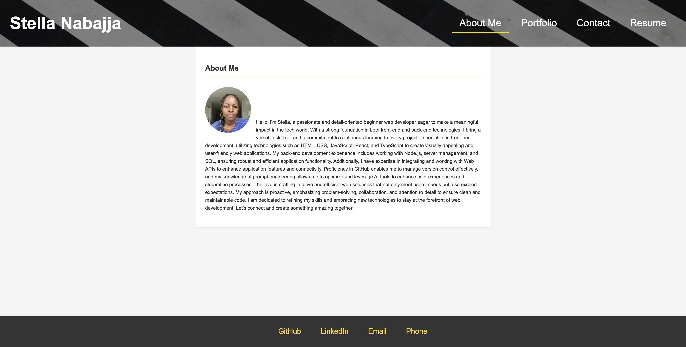

# React Portfolio

## Description

The React Portfolio is a single-page application created using React and Vite. It showcases various sections that highlight my experience, projects I have worked on, proficiencies as a developer, and contact information in an elegant and easy-to-navigate design. Below is a description of each section of the portfolio.

## Table of Contents

- Installation
- Usage
- License
- Contributing
- Tests
- Questions

## Installation

Install Vite (npm create vite).
Install dependencies (npm install).

## Usage

The user starts the application by using the command “npm run dev” in their terminal. This command starts the server which loads the page in the browser. The About Me section is the landing page and presents a short bio and profile image. The Portfolio section showcases images of my projects, where hovering over them reveals the project title and a GitHub icon that links to the project’s repository. The Contact section contains a form that visitors can use to reach out to me directly. The Resume section lists my proficiencies as a web developer and provides a download link for my full resume. And the Footer contains links to my GitHub, LinkedIn, email, and phone number.

Below is a screenshot of the deployed application.

Below is a link to my deployed application on Netlify.
https://stellas-portfolio.netlify.app/

## License

This project is licensed under the [MIT](https://opensource.org/licenses/MIT) license.

## Contributing

If you wish to contribute to this project, feel free to fork the repository, create a branch, and submit a pull request with your changes. Ensure your code is well-documented, and your changes are tested before submitting.

## Tests

There are no specific tests currently included in this project, but you can add your own testing frameworks or unit tests as necessary.

## Questions

Please contact me with any questions you may have at [snabajja@gmail.com](mailto:snabajja@gmail.com) or visit my GitHub profile at [snabaj](https://github.com/snabaj).
